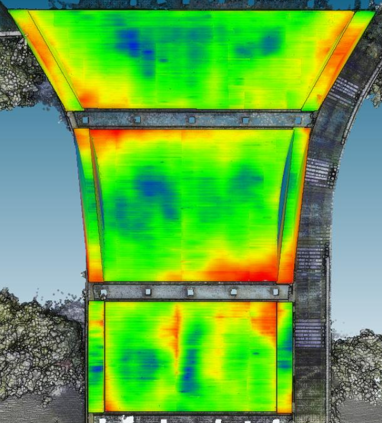
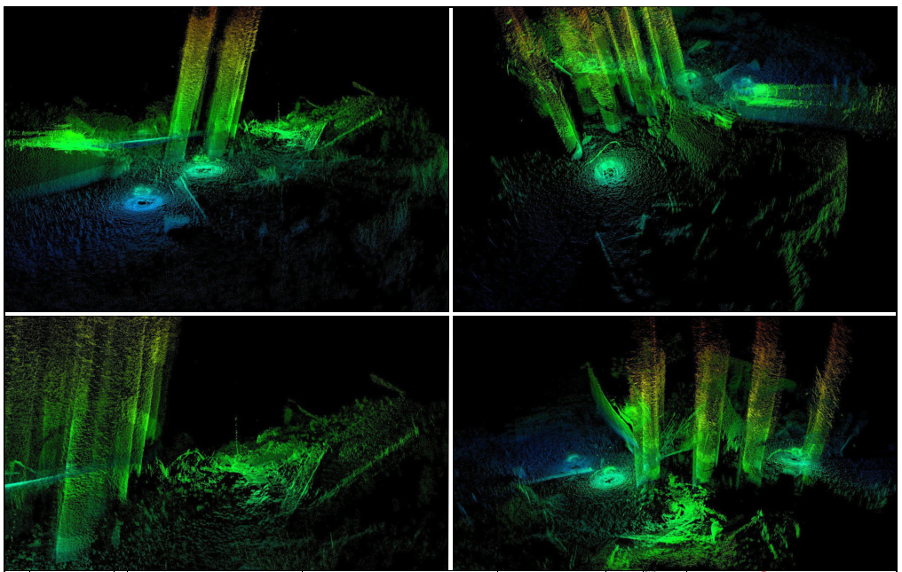
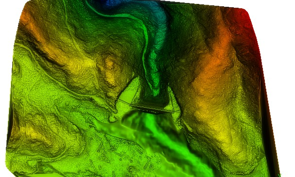

# Selected geospatial work

My geospatial work connects field capture, spatial processing, quantitative analysis, and technical reporting. These anonymised summaries draw on projects across infrastructure, marine, and environmental applications.

They describe my professional experience. Client datasets, asset identifiers, and original project deliverables are not included.

## Structural deformation and alignment

**The task:** Measure geometric irregularities that are difficult to assess through visual inspection alone.

I processed terrestrial LiDAR into registered, cleaned, and segmented point clouds, then measured deviations against reference planes and control geometry. Colour-mapped deviations, sectional profiles, and annotated outputs made sag, uplift, lean, and alignment differences easier to interpret.

Related hydropower work involved isolating structural and mechanical features and measuring alignment at regular vertical intervals. The outputs provided quantitative evidence for engineering review and a reference for subsequent monitoring.

**Methods:** Terrestrial LiDAR · Point-cloud registration · Reference geometry · Deviation analysis · Profiles

## Marine ROV and sonar inspection

**The task:** Inspect and measure submerged infrastructure where access and visibility limit conventional inspection.

I worked with ROV-based sonar and video capture, processing sonar-derived point clouds to identify structural elements, debris, and spatial relationships. Measurements and annotated visuals connected the survey data to condition reporting and engineering assessment.

This work required understanding both the limitations of field capture and the processing needed to turn acoustic and visual evidence into usable spatial information.

**Methods:** ROV operations · 3D sonar · Video review · Point-cloud processing · Condition reporting

## Integrated terrain and bathymetric modelling

**The task:** Produce a continuous surface across land and submerged areas from different survey systems.

I combined aerial LiDAR, terrestrial SLAM LiDAR, and echo-sounder bathymetry in a common coordinate framework. Processing focused on alignment, differences in resolution, and consistency at the transitions between datasets.

The result was a unified terrain and bathymetric model for further analysis, visualisation, and planning.

**Methods:** Multi-sensor integration · Coordinate control · Surface modelling · Transition-zone quality checks

## Penstock geometry and condition assessment

**The task:** Provide a measurable record of a large-diameter penstock's geometry and condition.

I processed high-resolution LiDAR into longitudinal profiles and cross-sections, examining alignment changes, joint transitions, surface irregularities, and deformation along the asset.

The resulting profiles and annotated outputs supported engineering assessment and maintenance planning with an objective geometric record.

**Methods:** LiDAR · Cross-sections · Longitudinal profiles · Geometric comparison · Technical reporting

## UAV vegetation analysis and machine learning

**The task:** Assess vegetation regeneration using repeatable measurements from aerial imagery.

I processed UAV imagery into orthomosaics and point clouds, trained an object-detection model to identify individual saplings, and deployed the detection workflow in a GIS environment. Results were checked against GNSS ground-truth data.

This university capstone connected image preparation, supervised model training, spatial analysis, and field validation. It is an important part of my interest in building practical tools around geospatial machine learning.

**Methods:** UAV imagery · Photogrammetry · Object detection · GIS integration · GNSS validation

## Volumetric analysis in constrained infrastructure

**The task:** Quantify material volumes and spatial change where conventional measurement is difficult.

I processed 3D survey data, including photogrammetry derived from video, into aligned point clouds and extracted surfaces for volumetric comparison. Deliverables included numerical summaries, annotated plans, and cross-sections.

The focus was on making the calculation and its spatial context understandable to the people using the result.

**Methods:** Photogrammetry · Point-cloud alignment · Surface extraction · Cut-and-fill analysis

## Inspect the geometry yourself

[Explore a real survey point cloud in 3D](SHOWCASE.md), or [discuss a project](WORK-WITH-ME.md).

## From analysis to software

Working through these projects has shaped what I build now: tools that keep evidence organised, reduce repeated processing, and make the route from capture to a finished deliverable more direct.

[Explore my software projects](PROJECTS.md) · [Back to my profile](https://github.com/elliottcromer4-beep) · [LinkedIn](https://www.linkedin.com/in/elliott-cromer-a7a9761a7/)
