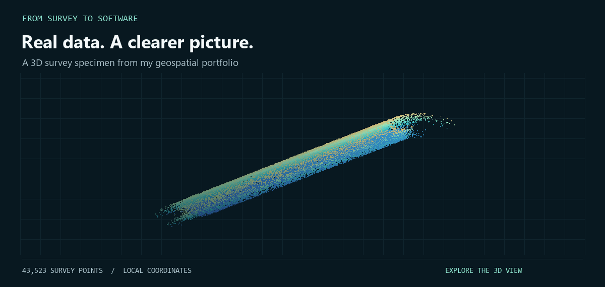

# Transmission tower LiDAR

**[Rotate and inspect the tower](survey-cloud-3d.stl)** · [View the still image](survey-cloud-preview.png)

A detailed scan resolves the tower structure, its connections, and the spaces between them. Working with the geometry makes it possible to isolate components, extract dimensions, establish reference lines, and compare repeat surveys.

## Explore the structure

Drag to rotate, scroll to zoom, or use the viewer controls to inspect the scan from different angles. Height colouring in the animation makes the levels easier to distinguish.

## From a scan to a useful result

I work through registration, cleaning, feature isolation, and reference-based analysis to turn dense point clouds into understandable outputs: sections, alignment measurements, deviation maps, and technical reporting.

The same approach informs the tools I build — make complex data easier to inspect and keep the path from evidence to deliverable clear.

Display and data notes

The animation shows 55,000 points sampled from a 19,904,728-point LiDAR dataset. The interactive STL shows 12,000 of these as small point markers, rather than a reconstructed surface. Both use local coordinates; the original geographic offsets and metadata are omitted. The STL is uniformly scaled for display. Animation colours indicate relative elevation, not condition or defect severity. These visualisations are for exploration, not engineering measurement.

[Geospatial case studies](PORTFOLIO.md) · [Software tools](PROJECTS.md) · [Discuss a project](WORK-WITH-ME.md)
